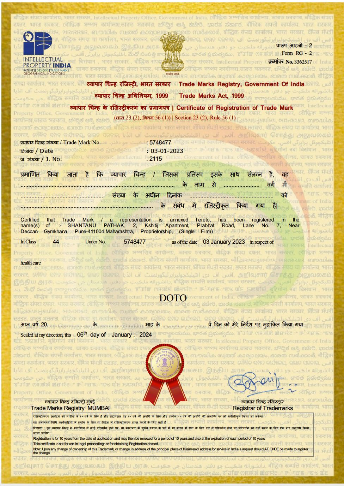

<a id="readme-top"></a>

# AI Case Summarization — Maternal & Labour Care

[](./LICENSE.md)
[](#status--roadmap)

AI-assisted summarization of intrapartum case sheets, so clinicians get an accurate, up-to-date
picture of a mother's condition in seconds at shift handovers, consultant rounds, and
emergency referrals without re-reading the full case sheet.

Part of Doto Health's open source initiative supported by UNICEF, targeting the intrapartum
period in high-volume, resource-constrained hospital settings.

> ⚠️ **Clinical disclaimer:** This solution is a clinical **documentation assistant**, not a
> diagnostic or decision-making tool. It does not perform diagnosis, risk prediction, or
> treatment planning, and every summary is reviewed and signed off by a clinician before use.
> It is not a certified medical device.

**[Explore the architecture »](./ARCHITECTURE.md)** · [Project Charter](./PROJECT_CHARTER.md) · [Developer Docs](./docs/index.md)

---

## Table of Contents

- [About](#about)
- [Architecture Overview](#architecture-overview)
- [Solution Structure](#project-structure)
- [Status & Roadmap](#status--roadmap)
- [Contributing](#contributing)
- [License](#license)

---

## About

Labour room clinicians manage a large amount of maternal clinical information: obstetric history, vitals, fetal monitoring, labour progression, medications, and clinical notes. During shift changes, consultant rounds, and emergency referrals, they need a quick, accurate read on the mother's current status, but reviewing the full case sheet takes time, and there is no standard way to produce a short summary.

This solution is building an AI assisted maternal case summarization framework. It converts detailed case sheets into concise, clinically relevant summaries, without altering or interpreting the original clinical documentation.

This repository covers Part 1 only: the AI summarization pipeline, from data intake through to a summary endpoint. Part 2, a Dashboard (portal) for clinicians to view summaries, is a separate, later phase that has not started.

<p align="right">(<a href="#readme-top">back to top</a>)</p>

## Architecture Overview

The pipeline is a hybrid of deterministic clinical logic and AI-based language generation,
split into six phases:

1. **Intake** : Pull the latest patient record and the previous summary, and compute values like gestational age.
   parameters (e.g. gestational age).
2. **Deterministic Detection** : Check the record against WHO Labour Care Guide thresholds to flag danger signs, no AI involved. This also classifies the patient as Normal or High-risk.
   involved. Classifies the patient as Normal or High-risk.
3. **AI Background Drafting** : An LLM writes the mother's clinical background from free text notes. This runs once and is reused across summaries.
4. **Merger LLM** : Assembles the final summary: current situation, what changed, and active alerts. The Recommendation is always left blank for the clinician to fill in.
   alerts as clear points. The Recommendation is always left blank for the clinician.
5. **Verify (governance)** : a deterministic check confirms every number, alert, and change
   exactly matches the source data before anything reaches a clinician. Failing that check
   regenerates the summary (max 2 attempts), then falls back to a rules-only summary.
6. **Deliver** : the clinician reviews, writes the Recommendation, and signs off.

See **[ARCHITECTURE.md](./ARCHITECTURE.md)** for the full breakdown, including the design

<p align="right">(<a href="#readme-top">back to top</a>)</p>

## Solution Structure

This is the planned layout. Pipeline code has not been published yet — see
[Status & Roadmap](#status--roadmap).

```
├── src/                    # pipeline code (planned, not yet published)
│   ├── intake/              # Phase 1
│   ├── rules_engine/        # Phase 2 — WHO Labour Care Guide checks
│   ├── llm_summary/         # Phases 3–4 — background + merger LLM stages
│   └── verification/        # Phase 5 — deterministic grounding checks
├── data/
│   └── synthetic/           # synthetic dataset (planned)
├── configs/                 # model config — points to a local/HF model path, no weights committed
├── docs/                    # developer documentation (GitHub Pages)
├── ARCHITECTURE.md
├── PROJECT_CHARTER.md
├── QA_PROCESS.md
├── CONTRIBUTING.md
├── CODE_OF_CONDUCT.md
├── LICENSE
└── README.md
```

<p align="right">(<a href="#readme-top">back to top</a>)</p>

## Models

This solution does not lock users into one hosting approach. A set of open models is being evaluated and will be published as recommended, tested defaults, but the pipeline is designed so a deployer can plug in either a locally hosted model or an API based model instead, whichever suits their setup.

No model weights are committed to this repository (see `.gitignore`). Recommended local models are downloaded from Hugging Face at setup time. Model selection is not finalized yet; see [docs/model-setup.md](./docs/model-setup.md) for what is being evaluated and how model choice will be configured.

<p align="right">(<a href="#readme-top">back to top</a>)</p>

## Status and Roadmap

This solution is in active solution design and prototyping. It is not production ready and there is no public API yet.

- [x] Problem definition, literature review (SBAR, I-PASS, SOAP), and solution architecture
- [x] Six phase pipeline design finalized
- [x] Evaluating candidate models, both local and API based
- [x] Real clinical dataset collection and synthetic data generation underway
- [ ] Pipeline code (intake, rules engine, LLM stages, verification)
- [ ] Model selection finalized
- [ ] API and summary endpoints(software / system agnostic)
- [ ] Evaluation harness run against the finalized pipeline
- [ ] Part 2, Dashboard (portal) (not started, separate phase)

Planned for this repository next: the synthetic dataset, pipeline code, setup and run instructions, and instructions for connecting a chosen model, local or API, to the summary endpoints.

## Contributing

This solution is pre-alpha. The architecture is settled, implementation is in progress. Contributions, questions, and issues are welcome. See [CONTRIBUTING.md](./CONTRIBUTING.md) for setup notes and the PR process, and [QA_PROCESS.md](./QA_PROCESS.md) for how summaries are evaluated for clinical grounding.

All contributors are expected to follow the [Code of Conduct](./CODE_OF_CONDUCT.md).

## License

Licensed under the [Apache License 2.0](./LICENSE.md).

<p align="right">(<a href="#readme-top">back to top</a>)</p>

## Contact

DOTO Software - software@dotohealth.com

Project Link: [https://github.com/DOTO-Health/ai-clinical-case-summarisation.git](https://github.com/DOTO-Health/ai-clinical-case-summarisation.git)

<p align="right">(<a href="#readme-top">back to top</a>)</p>

---

<p align="center">
  
</p>

<p align="center">
  <sub>DOTO and the DOTO logo are trademarks of DOTO Health. Licensed under Apache 2.0 — trademark use is not covered by the code license. See <a href="./LICENSE.md">LICENSE.md</a>.</sub>
</p>
